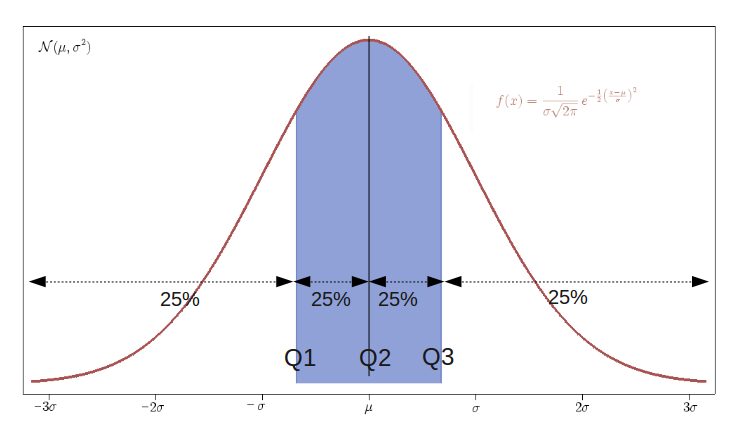

Thống kê là một phần quan trọng không thể thiếu trong machine learning. Thống kê giúp ta có thể hiểu được bộ dữ liệu của mình. Dưới đây là một vài khái niệm mình đã tìm hiểu và lưu lại. 

## **Mô tả một tập dữ liệu**

Giả sử ta có một bộ dữ liệu về thời gian chạy bộ 100m trong 6 lần chạy của bản thân (thời gian tính bằng giây). Ta sẽ thu được một bảng dữ liệu như sau:

  Từ bộ dữ liệu trên ta có thể suy ra một số thông tin cơ bản như lần chạy nào nhanh nhất hay chậm nhất tuy nhiên ta cần biết nhiều hơn thế.

## **Xu hướng tập trung (Central Tendencies)**

Một trong những phương pháp đo lường phổ biến trong thống kê là đo xu hướng tập trung theo 3 tham số:

- Trung bình (mean hoặc average)
- Trung vị (Media)
- Mode (Số có tần suất xuất hiện nhiều nhất trong mẫu)

**Mean**

Là tổng của tất cả các giá trị trong của dữ liệu chia cho kích thước mẫu. Trong ví dụ trên số giây trung bình 6 lần chạy là:

Với Si là số giây của lần chạy thứ i.

**Median**

Trong lý thuyết xác suất và thống kê, số trung vị là một số tách giữa nửa lớn hơn và bé hơn của một mẫu sao cho 2 nửa có số phần tử bằng nhau. 

Median đựớc tính bằng cách sắp xếp dữ liệu và lấy phần tử ở giữa. Nếu số lượng phần tử là một số chẵn thì median là trung bình của 2 giá trị ở giữa.

Ví dụ ta có 2 tập sau:

S1 = {7, 3, 3, 4, 5}

S2 = {8, 4, 5, 6, 7, 8}

Trước khi tính trung vị, ta cần sắp xếp S1 và S 2 theo thứ tự tăng dần:

S1 = {3, 3, 4, 5, 7}

S2 = {3, 4, 5, 6, 7, 8}

Từ đó có thể thấy Median (S1) = 4, Median(S2) = (5+6) / 2 = 5.5

**Quantile**

Quantile là dạng tổng quát của Median, là những giá trị (điểm cắt) chia tập mẫu thành p phần có số phần tử bằng nhau. Khi đó ta gọi các điểm này là p-quantiles. Median tương ứng với 2-quantiles. Có một quantile phổ biến được dùng trong xác suất thống kê là [tứ phân vị](https://vi.wikipedia.org/wiki/T%E1%BB%A9_ph%C3%A2n_v%E1%BB%8B) (4-quantiles).

Ví dụ:

S1 = {5, 7, 9, 14, 25, 34, 48}

Ta thấy giá trị Median của tập S1 = 14. Median của phần dưới {5, 7, 9} = 7 và median của phần trên {25, 34, 48} = 34. Như vậy, ta lần lượt có Q1 = 7, Q2 = 14, Q3 = 34. 

**Mode**

Mode là số có tần suất xuất hiện nhiều nhất trong tập dữ liệu. Ví dụ:

S1 = {1, 1, 1, 2, 3, 4}

Mode(S1) = 1. Vì 1 xuất hiện nhiều nhất trong tập S1

## **Đo lường sự biến thiên của dữ liệu (Variation of Data)**

Để đo lường sự biến thiên (sự thay đổi) ( thường so với giá trị trung bình) của dữ liệu người ta thường dùng các tham số như **Range** (khoảng biến thiên), **Interquartile Range** (IQR - khoảng tứ phân vị), **Standard Deviation** (độ lệch chuẩn), **Variance** (phương sai) và **Standard Error** (sai số chuẩn).

**Range**

Được tính bằng cách lấy giá trị lớn nhất trừ giá trị nhỏ nhất trong mẫu. Với ví dụ thời gian chạy 100m ta có:

Range = 25.1 - 17.9 = 7.2 (s)

**Deviation**

Trong thống kê, khi muốn đo lường sự phân tán của dữ liệu so với giá trị trung tâm ta dùng khái niệm độ lệch (devation). Giả sử ta sử dụng giá trị trung bình làm giá trị trung tâm, khi đó có tổng độ lệch của tất cả quan sát với giá trị trung bình trong mẫu có n giá trị là:

Vì các giá trị si có thể lớn, bằng hay nhỏ hơn Mean nên giá trị độ lệch mỗi lần quan sát sẽ có những giá trị âm, dương hay 0 và điều này sẽ dẫn đến kết quả tổng độ lệch d có thể bằng 0. Để tránh sự bất tiện này, chúng ta sẽ dùng giá trị tuyệt đối cho các độ lệch và cũng để không bị ảnh hưởng từ kích thước mẫu chúng ta sẽ dùng công thức tổng độ lệch như sau:

Tuy nhiên, vấn đề của giá trị tuyệt đối là tính không liên tục tại gốc tọa độ nên chúng ta sẽ sử dụng các công cụ khác để đo lường sự phân tán của dữ liệu như phương sai (variance) và độ lệch chuẩn (standard deviation).

**Variance và Standard deviation**

Trong xác suất thống kê có hai khái niệm cơ bản là **population** (tạm dịch: quần thể) và **sample**. Population là một tập hợp có số lượng lớn các cá thể (hay các tên gọi khác như phần tử, thành viên, v.v.) và một sample là một tập con hay tập mẫu của population. Để tiện việc minh họa, các khái niệm hay công thức trong bài viết này được áp dụng trên các sample thay vì population.

Vì hạn chế của giá trị tuyệt đối trong công thức tính **độ lệch** nên chúng ta có thể sử dụng khái niệm **phương sai (variance)** để đo lường sự phân tán của dữ liệu. Phương sai áp dụng cho tập mẫu (sample) gồm n phần tử gọi là phương sai mẫu (sample variance) có công thức như sau:

Lưu ý rằng, nếu phương sai áp dụng trên tập population có N cá thể thì công thức sẽ là:

Vấn đề dùng (n-1) hay N liên quan đến các khái niệm ước lượng chệch (biased estimator) và ước lượng không chệch (unbiased estimator). Có thể tìm hiểu thêm tại [đây](https://en.wikipedia.org/wiki/Bessel%27s_correction).

Phương sai là tham số rất tốt để đo lường sự biến thiên (hay phân tán) của dữ liệu trong mẫu vì nó đã quan tâm đến độ lệch của mỗi quan sát so với số trung bình, loại bỏ ảnh hưởng của kích thước mẫu và là hàm mượt. Tuy nhiên, điểm yếu của phương sai là không cùng đơn vị tính với Mean. Đơn vị tính của phương sai là bình phương của đơn vị tính của trung bình. Chẳn hạn, đơn vị tính của thời gian chạy trung bình là giây trong khí đó đơn vị tính của phương sai là giây bình phương. Để giải quyết vấn đề này, người ta lấy căn bậc 2 của phương sai và kết quả này gọi là **độ lệch chuẩn (Standard Deviation)**. Công thức độ lệch chuẩn (áp dụng trên tập mẫu):

**Correlation**

Trong lý thuyết xác suất và thống kê, hệ số tương quan (Coefficient Correlation) cho biết độ mạnh của mối quan hệ tuyến tính giữa hai biến số ngẫu nhiên. Từ tương quan (Correlation) được thành lập từ Co- (có nghĩa “together”) và Relation (quan hệ).

Hệ số tương quan giữa 2 biến có thể dương (positive) hoặc âm (negative). Hệ số tương quan dương cho biết rằng giá trị 2 biến tăng cùng nhau còn hệ số tương quan âm thì nếu một biến tăng thì biến kia giảm.

Một khái niệm quan trọng khác liên quan đến tính tương quan là hiệp phương sai (covariance). Nếu phương sai dùng để đo lường sự biến thiên của một biến ngẫu nhiên (hay dữ liệu trên một tập mẫu) thì hiệp phương sai đo lường sự biến thiên của hai biến ngẫu nhiên (hay dữ liệu trên hai tập mẫu cùng số cá thể). Công thức hiệp phương sai của hai biến (hay hai tập mẫu có cùng n cá thể) x, y:

Công thức tính hệ số tương quan dựa trên hiệp phương sai như sau:

Với sdx và sdy tương ứng là độ lệch chuẩn của x và y.

