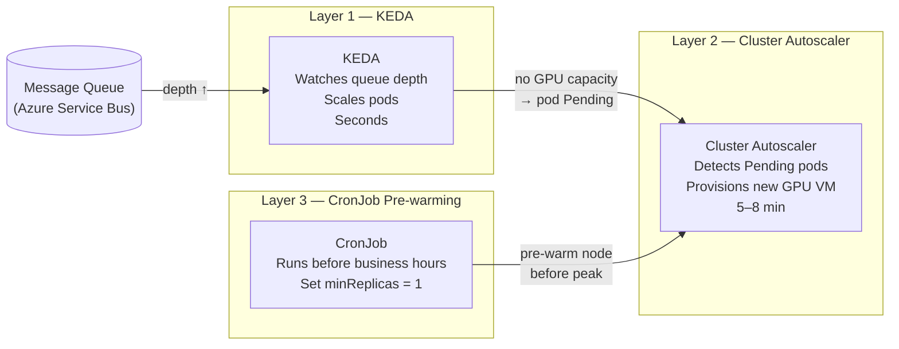

# AKS Auto-Scaling — 3-Layer System

How to design auto-scaling for AI inference workloads on Azure Kubernetes Service that delivers SLA + cost efficiency simultaneously. Three independent layers work together — each reacts at a different speed.

## The Core Problem

You need to:
1. Keep GPU inference latency < 60s (SLA)
2. Not pay for always-on GPU nodes overnight and weekends (cost)
3. Prevent batch jobs from starving real-time queues (fairness)

No single scaling mechanism solves all three. You need three layers.

## Overview

```
Layer 3: CronJob pre-warming    → timezone-aware, runs minutes ahead of traffic
Layer 2: Cluster Autoscaler     → GPU node provisioning, 5–8 min reaction time
Layer 1: KEDA pod scaling       → inference replica scaling, seconds reaction time
```



---

## Layer 1: KEDA — Pod Scaling (Seconds)

**KEDA (Kubernetes Event-Driven Autoscaler)** watches an external metric (queue depth, message count) and scales pod replicas up/down accordingly.

**Why not just HPA (Horizontal Pod Autoscaler)?** HPA scales on CPU/memory. For AI inference, the trigger is *queue depth* — how many messages are waiting to be processed. KEDA supports Azure Service Bus, Kafka, Redis, and many others as trigger sources.

```yaml
apiVersion: keda.sh/v1alpha1
kind: ScaledObject
metadata:
  name: vllm-realtime-scaler
spec:
  scaleTargetRef:
    name: vllm-realtime
  minReplicaCount: 1        # 1 pod always during business hours
  maxReplicaCount: 8
  cooldownPeriod: 300       # Wait 5 min before scaling down
  triggers:
    - type: azure-servicebus
      metadata:
        queueName: so-processing-queue
        messageCount: "5"   # +1 pod per 5 queued messages
```

**Key config decisions:**
- `cooldownPeriod` — prevents thrashing. Don't scale down immediately after a burst drains.
- `messageCount` threshold — tune based on processing time. If each pod handles 1 message in ~30s, set threshold so you have enough pods to keep up.
- `minReplicaCount` — set to 1 during business hours (via CronJob), 0 overnight.

---

## Layer 2: Cluster Autoscaler — Node Scaling (5–8 min)

When KEDA tries to schedule a new pod but no node has capacity, the pod goes `Pending`. The **Cluster Autoscaler** detects `Pending` pods and requests a new VM from Azure.

**The 5–8 min problem:** For < 60s SLA, you can't wait for a new node. The mitigation: **trigger node provisioning early** — at 70% GPU utilisation, not 100%.

```yaml
# Custom KEDA trigger: scale at 70% GPU utilisation
- type: azure-monitor
  metadata:
    metricName: node_gpu_usage_percentage
    targetValue: "70"    # Request node 2 before node 1 is full
```

This means node 2 finishes provisioning *before* node 1 saturates. Most burst POs never wait.

**Node pool config:**

```bash
# On-demand pool for real-time inference (never preempted)
az aks nodepool add \
  --name gpurealtime \
  --node-vm-size Standard_NC24ads_A100_v4 \
  --enable-cluster-autoscaler \
  --min-count 0 --max-count 4 \
  --node-taints dedicated=realtime:NoSchedule

# Spot pool for batch (60% cheaper, tolerates interruption)
az aks nodepool add \
  --name gpubatch \
  --node-vm-size Standard_NC24ads_A100_v4 \
  --priority Spot \
  --enable-cluster-autoscaler \
  --min-count 0 --max-count 8 \
  --node-taints dedicated=batch:NoSchedule
```

**What happens when a spot node gets preempted?** Azure reclaims it with 30s notice. Pods are evicted. Jobs retry automatically. This is fine for batch (nightly re-indexing, ML training) but not for real-time inference — hence separate pools.

---

## Layer 3: CronJob Pre-Warming (Minutes Ahead)

GPU cold start (VM provision + model load) takes 5–8 min. A CronJob pre-warms the node 15 min before business hours start, and scales down 30 min after close.

**Timezone challenge:** If you serve multiple countries across timezones, find the earliest business-hours start and pre-warm for that. One warm window covers all countries.

Example: 8 APAC countries from UTC+2 to UTC+9, hub in Singapore (UTC+8):

| Window | SGT time | What happens |
|---|---|---|
| Pre-warm | 07:45 Mon–Fri | Set minReplicas=1 — node provisions, models load |
| Business window | 08:00–23:00 | All 8 countries' business hours covered |
| Scale-down | 23:30 Mon–Fri | Set minReplicas=0 — node terminates |
| Weekend | All day Sat–Sun | minReplicas=0 — zero GPU cost |

```yaml
# Pre-warm at 07:45 SGT Monday–Friday
apiVersion: batch/v1
kind: CronJob
metadata:
  name: gpu-prewarm-morning
spec:
  schedule: "45 7 * * 1-5"
  jobTemplate:
    spec:
      template:
        spec:
          containers:
            - name: scaler
              image: bitnami/kubectl:latest
              command:
                - kubectl
                - patch
                - hpa/vllm-realtime-scaler
                - --patch
                - '{"spec":{"minReplicas":1}}'
```

**Cost impact:** With a 15.75h/day warm window (weekdays only) vs always-on:
- Always-on: 720 hrs/month × $3.40 = **$2,450/month**
- Pre-warm only: ~315 hrs/month × $3.40 = **$1,140/month** (-53%)

---

## Node Pool Isolation — Taints and Tolerations

Batch jobs must never run on real-time nodes. Enforce this with **node taints** and **pod tolerations**:

```yaml
# Real-time node: tainted — only pods with matching toleration can schedule
Node taint: dedicated=realtime:NoSchedule

# vLLM real-time pod: has the toleration → can schedule on gpu-realtime
tolerations:
  - key: "dedicated"
    value: "realtime"
    effect: "NoSchedule"

# Batch pod: no toleration → blocked from gpu-realtime automatically
# (Kubernetes scheduler enforces this, no human policing needed)
```

---

## How All 3 Layers Interact — End-of-Month Burst

| Time | Event | Layer |
|---|---|---|
| 07:45 | CronJob fires → node 1 provisions, models load | Layer 3 |
| 09:00 | 50 POs arrive → KEDA scales pods 1→5 on node 1 | Layer 1 |
| 09:05 | 200 POs arrive → KEDA needs pods 6–8, node 1 GPU at 70% | Layer 1 |
| 09:05 | Pod 6 goes Pending → Cluster Autoscaler requests node 2 | Layer 2 |
| 09:13 | Node 2 joins → pods schedule, processing doubles | Layer 2 |
| 17:30 | JP queue drains → KEDA scales down pods → node 2 idles | Layer 1 |
| 17:40 | Node 2 idle 10 min → Cluster Autoscaler terminates it | Layer 2 |
| 23:30 | CronJob fires → node 1 minReplicas=0 → terminates | Layer 3 |

---

## When the 5–8 Min Wait Still Happens

Even with all mitigations, an extreme burst (200 POs on a cold morning) can cause a queue wait. Key points:

- POs in the queue are **never lost** — Service Bus is durable
- The wait is a queue wait, not a failure
- Once node 2 is up, **both nodes drain the backlog together**
- For predictable peaks (end of month/quarter) → **manually pre-scale** `minCount=2` the night before

## Related

- [Kubernetes: Pod vs Node](./kubernetes-pod-node)
- [GPU Inference Serving with vLLM](./gpu-inference-vllm)
- [Enterprise AI Hub Architecture Pattern](./enterprise-ai-hub-pattern)
