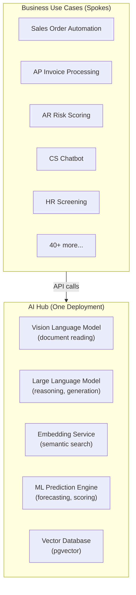

# Enterprise AI Hub — Architecture Pattern

A design pattern for building a centralised, multi-tenant AI platform that serves multiple business use cases and countries from a single deployment. Learned from designing the Motul APAC AI Hub.

## The Problem with Siloed AI

Most enterprises start AI projects the naive way: one project = one AI infrastructure. This leads to:

| Problem | Impact |
|---|---|
| Each project builds its own GPU cluster | 5–10× higher total infrastructure cost |
| Models trained/hosted separately | No shared learning, inconsistent quality |
| Security/governance duplicated per project | Compliance risk, audit complexity |
| New use case takes 6–12 months | Slow to deliver value |

## The Hub-and-Spoke Pattern

One centralised AI Hub provides shared AI capabilities. Business use cases ("spokes") consume them via API — no spoke builds its own AI engine.



**The economics:** Layers 1–4 (Cloud, GPU, Infrastructure, AI Models) are fixed costs that barely change whether you run 1 or 40 use cases. Only the application layer varies.

| Metric | Siloed | Hub |
|---|---|---|
| Time to deploy new use case | 6–12 months | 6–8 weeks |
| Cost per use case (1 active) | High | High |
| Cost per use case (10 active) | Still high (each has own infra) | ~10× cheaper |
| Data intelligence | Siloed | Cross-domain (all data flows through one hub) |
| Governance | Duplicated | Centralised |

## The 5-Layer AI Stack

| Layer | Purpose | Components |
|---|---|---|
| **Layer 5** — Applications | Business automation & intelligence | 40+ use cases per domain |
| **Layer 4** — AI Models | Cognitive & prediction engine | VLM, LLM, Embedding, ML |
| **Layer 3** — Platform | Enterprise AI runtime | AKS, pgvector, Redis, Service Bus, API Management |
| **Layer 2** — GPU Compute | High-performance AI processing | A100 nodes, vLLM, auto-scaling |
| **Layer 1** — Cloud | Reliable & sustainable base | Azure Singapore, 99.9% SLA |

**Key insight:** Layers 1–4 are built once and shared. Only Layer 5 changes per use case. The incremental cost of a new use case is near-zero once the hub is live.

## Multi-Pool AKS Topology

The hub runs on AKS with three node pools, each with a different operating contract:

| Pool | VM type | Billing | Priority | Purpose |
|---|---|---|---|---|
| `gpu-realtime` | NC24ads_A100_v4 | On-demand | High | Real-time inference (< 60s SLA) |
| `gpu-batch` | NC24ads_A100_v4 | Spot (~60% cheaper) | Low | Batch jobs, model training, nightly sync |
| `cpu-app` | D8s_v3 | On-demand | Medium | Portal, API, pgvector, Redis, email |

**Why split?** A batch job (e.g., nightly model re-training, 4 hours) on a shared pool starves real-time inference. Kubernetes priority classes + node taints enforce separation automatically.

## Country Identification Before Processing

For a multi-country hub, country must be identified at intake — **before** the document is processed. Never infer country from document content.

**Three mechanisms:**

1. **Dedicated email inbox per country**
   - `po-japan@hub.com`, `po-thailand@hub.com`, etc.
   - Intake service knows country from which mailbox received the email
   - Most common, works for all countries

2. **Fax DID number (Japan / fax-based)**
   - Each fax line has a unique number → maps to a country
   - XDW format is also Japan-specific (double signal)

3. **API endpoint path / header (EDI/direct integration)**
   - `POST /api/v1/submit/JP` or header `X-Country-Code: JP`

**Why this matters:**
- SAP routing — each country has its own SAP system. Without a country tag, you don't know which BAPI endpoint to call.
- Per-country KEDA scaling — queue depth per country drives scaling decisions
- Monitoring — auto-processing rate, HITL queue depth per country
- Email confirmation language — determined by country tag, not document language inference

## The Confidence-Gated Automation Pattern

Never post AI results directly to production systems. Use a confidence score to decide routing:

```
Confidence ≥ 90%  →  Auto-post to ERP (no human touch)
Confidence 75–89% →  HITL review queue (human verifies flagged fields only)
Confidence < 75%  →  Full manual processing
```

**Why this matters:** The AI is not always right. But it doesn't need to be right 100% of the time — it needs to be right *often enough* that humans only review exceptions. Starting at 85% auto-processing rate and improving through continuous learning is better than 100% manual from day one.

**Continuous learning loop:** Every HITL correction is stored back in the vector database. Future documents with similar patterns get higher confidence scores automatically.

## Material / Entity Mapping Pattern (Two-Strategy Search)

For mapping unstructured customer text to structured master data (e.g., Japanese product name → SAP material code):

```
Strategy A: Exact / rule match (fast, O(1))
  → Check Redis cache for known mappings
  → If found: confidence 1.00, return immediately

Strategy B: Semantic vector search (handles new descriptions)
  → BGE-M3 converts text to embedding vector
  → pgvector finds top-5 nearest matches by cosine similarity
  → LLM picks the best match and explains why
  → Store result in pgvector for future Strategy A hits
```

The system learns: the more Strategy B runs, the more Strategy A hits in the future.

## Cost Amortisation — The Key Economic Argument

The strongest argument for the Hub pattern is infrastructure amortisation:

| Active use cases | Annual hub cost | Cost per use case / year |
|---|---|---|
| 1 | $13,320 | $13,320 |
| 7 | $13,320 | $1,903 |
| 13 | $25,368 | $1,951 |
| 23+ | $29,608 | **< $1,287** |

Infrastructure scales sublinearly (add 1 batch node per 2–3 new use cases). Use case count scales linearly. The ROI compounds with every wave.

## When to Use This Pattern

**Good fit:**
- Multiple AI use cases across the same enterprise
- Multi-country deployment with centralised governance requirements
- Mix of real-time (< 60s) and batch workloads
- Open-source models (self-hosted, not Azure OpenAI) for cost control

**Not a good fit:**
- Single use case with no roadmap for more
- Each use case has completely different data residency requirements (e.g., can't route Japan data through Singapore)
- Teams that need full isolation between use cases for org/security reasons

## Related

- [GPU Inference Serving with vLLM](./gpu-inference-vllm)
- [AKS Auto-Scaling — 3-Layer System](./aks-autoscaling)
- [Kubernetes: Pod vs Node](./kubernetes-pod-node)
