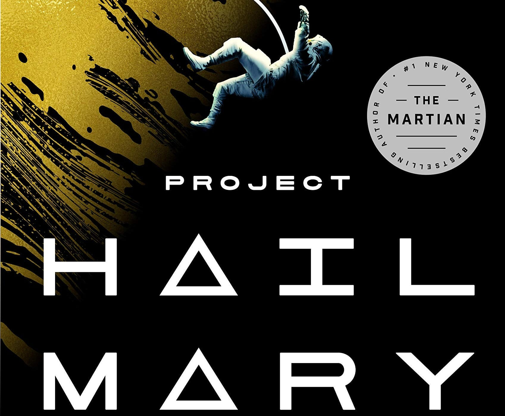

# Project Hail Mary

Chà hôm nay mình vừa đọc xong cuốn sách mà mình thực sự thích nó tới mức không thể rời mắt đầu tiên trong năm nay.
PROJECT HAIL MARRY 5/5⭐
Đây là tác phẩm khá mới của Andy Weir. Tác giả của cuốn Science Fiction nổi tiếng: The Martian. (The Martian có bản phim chuyển thể cũng rất hay)
Theo đánh giá của mình Project Hail Marry hoàn toàn có thể sách ngang hàng với người đàn anh của nó.

Tác phẩm này kể về Ryland Grace, một giáo viên cấp 2 bộ môn Khoa học. Anh thức dậy trên chiếc tàu vũ trụ tại một hệ sao nằm ngoài Hệ Mặt trời với không một chút ký ức nào về lý do anh đang ở đó. Ryland đã từng chút lấy lại ký ức của mình và nhận ra sứ mệnh tuyệt đối quan trọng của bản thân tại hệ sao này. Hành trình tìm về ký ức và thực thi sứ mệnh của anh bắt đầu từ đây, hành trình anh sử dụng khoa học và kỹ thuật để cứu vãn tình thế của mình. 

Đây chắc chắn là một tác phẩm must read với bất cứ ai ưa thích thể loại Science Fiction. Sau khi đọc xong, mình đã tìm thêm thông tin và cuốn sách sẽ có bản phim chuyển thể vào năm 2026. Can't wait 🥺
P/S: buồn chút vì ở Việt Nam chưa có nhà xuất bản nào dịch và xuất bản cuốn sách này 🥺