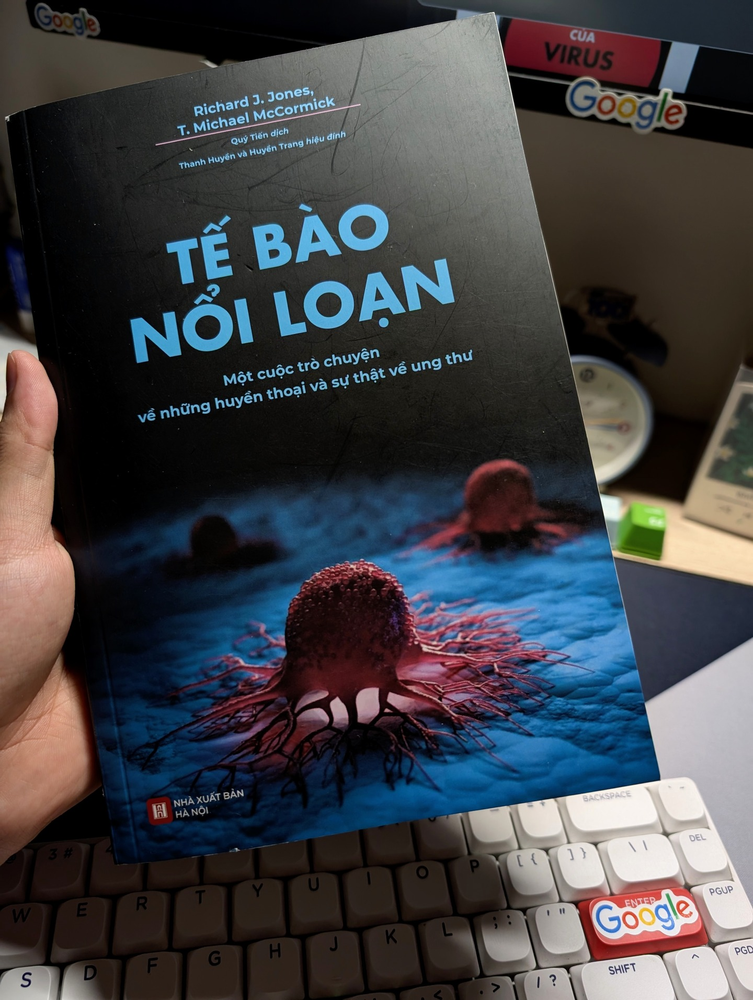

## Rogue Cells: A Conversation on the Myths and Mysteries of Cancer

Tế bào nổi loạn - Richard J. Jones & T. Michael McCormick
4/5 ⭐
"Ung thư" từ chắc hẳn mọi người đã nghe nhan nhản khắp mọi phương tiên truyền thông. Được biết đến như một căn bệnh chết chóc, một bản án tử cho những ai mắc phải. Nhưng bạn đã bao giờ tự hỏi bản chất của ung thư là gì, từ đâu mà có chưa? 🤔
Cuốn sách này cho mình một cái nhìn thẳng và các sự thật khá bất ngờ. Chẳng hạn: 

Khi bác sĩ nói "ung thư ở giai đoạn sớm", "giai đoạn đầu" thì thực tế đó là điểu không thể, việc phát hiện ra được khối ung thư tức là nó đã đi được 85% vòng đời của nó rồi.
Và việc mắc ung thư là "may rủi", chỉ cần bạn sống đủ lâu, một ngày nào đó "những tế bào nổi loạn" này sẽ tìm tới bạn. 

Cho dù nhiều loại ung thư không thể chữa khỏi hoàn toàn, nhưng vẫn có thể chung sống bởi có nhiều tiết bộ về y học nâng chất lượng cuộc sống của người bệnh và ngày càng nhiều phương pháp tiềm năng có thể làm "thuyên giảm toàn phần" tế bào ung thư.

Ít nhất mình đã một cái nhìn thẳng thắn về ung thư từ cách một tế bào bình thường "nổi loạn" ra sao? Được tìm hiểu các phương pháp điều trị và hơn hết không nên coi ung thư là "bản án từ hình", nên có cái nhìn lạc quan và tin tưởng vào rất nhiều các phương pháp điều trị tiềm năng đã và đang được nghiên cứu.