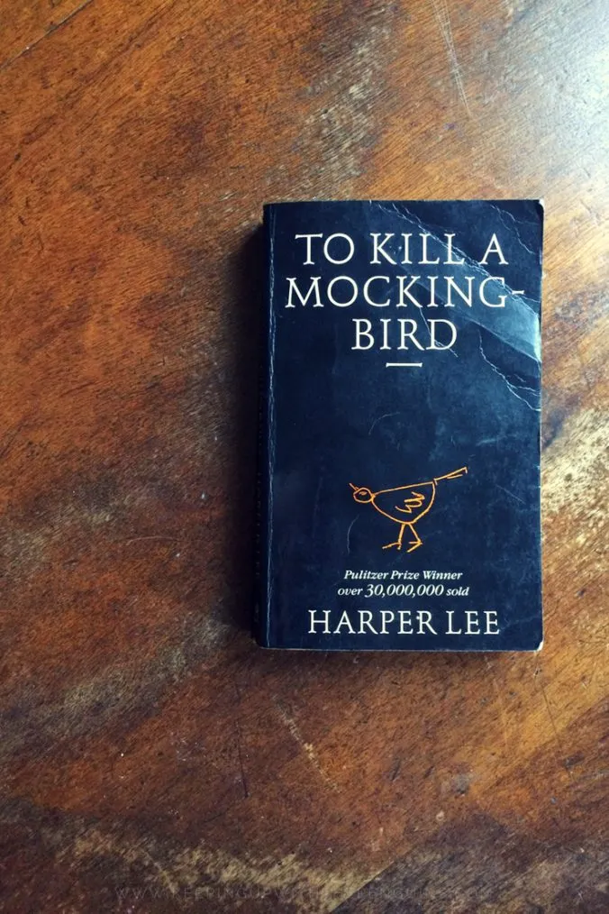

# To Kill a Mocking Bird

5/5⭐
Một tác phẩm kinh điển, lắng đọng mang lại trải nghiệm thư giãn, bài học về sự trưởng thành cùng những suy nghĩ về điều đúng và sai trong xã hội loài người.
Qua góc nhìn hồn nhiên của cô bé Jean Louise “Scout Finch” dẫn ta tới thị trấn nhỏ Maycomb, miền Nam nước Mỹ những năm 1930. Thời điểm nước Mỹ vừa xảy ra cuộc đại suy thoái và nạn phân biệt chủng tộc vẫn còn rất hằn sâu.

Từ một cô bé có tính cách bốc đồng, thích đánh nhau hơn mặc váy, Scout dần học cách nhìn thế giới qua lăng kính của lòng trắc ẩn và sự thấu hiểu. Sự giáo dục của người bố Atticus Finch, một luật sư chính trực, và những trải nghiệm đầy biến động tại Maycomb đã góp phần định hình nên nhân cách của cô. Mối quan hệ đặc biệt giữa Scout và Boo Radley, một nhân vật bí ẩn và là biểu tượng cho những người bị xã hội hiểu lầm, càng tô đậm thêm thông điệp về lòng nhân ái. 

Atticus Finch là một người cha, là hiện thân của công lý và đạo đức. Ông dạy các con về lẽ phải bằng những lời lẽ giản dị nhưng sâu sắc. Ông dũng cảm đứng lên bảo vệ Tom Robinson, một người đàn ông da đen bị buộc tội oan, bất chấp sự phản đối và đe dọa từ cộng đồng. Đây là một cuộc chiến mà Atticus đã gần như biết trước rằng ông sẽ thua. Tuy nhiên, như ông đã nói: "cho dù chúng ta đã bị đánh bại một trăm năm trước khi chúng ta bắt đầu thì đó cũng đâu phải là lý do khiến chúng ta không cố thắng".

"Giết Chết Con Chim Nhại" là một câu chuyện về thơi thơ ấu, là một câu chuyện về quá khứ, và là một lời nhắc nhở về sự cần thiết của lòng trắc ẩn, sự can đảm và sự bình đẳng. Một tác phẩm đáng đọc, nếu bạn muốn tìm kiếm những câu truyện tuổi thơ, có thể lay động tâm trí và để mở rộng trái tim. Highly recommend.