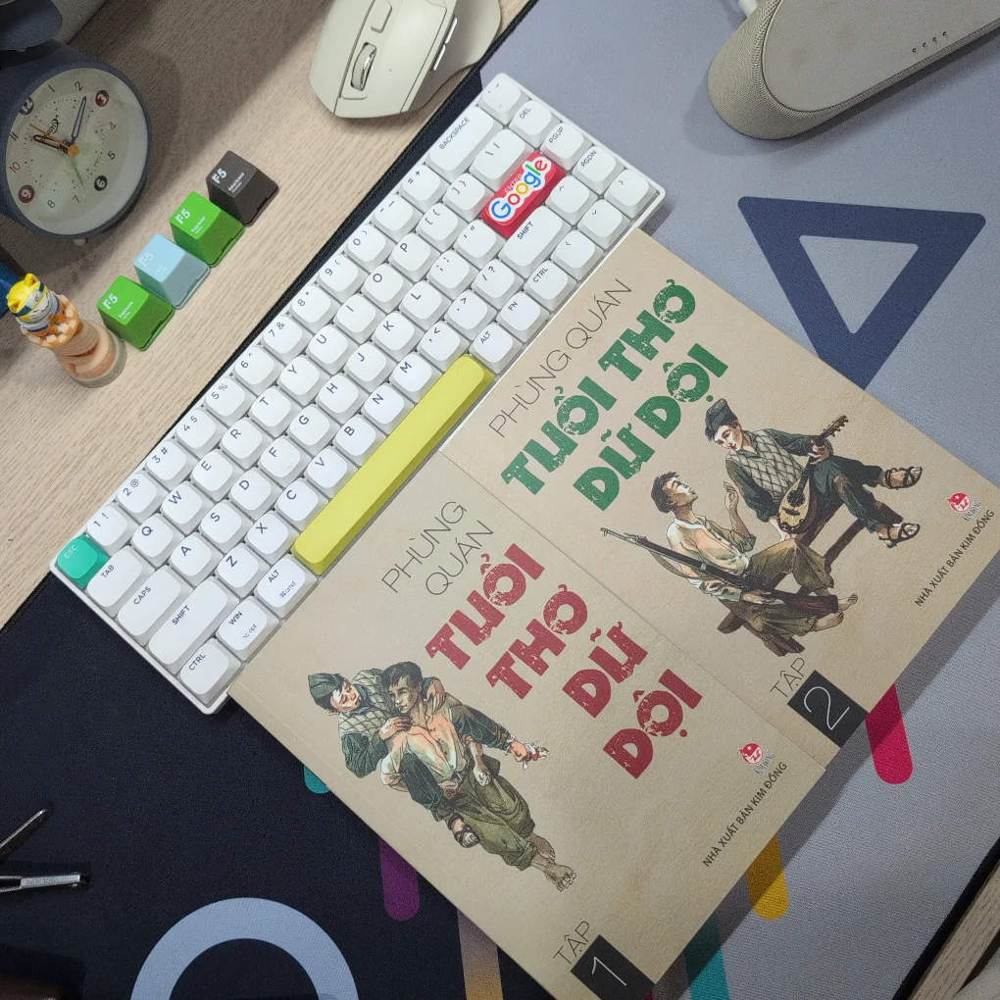

## Tuổi thơ dữ dội

Tuổi thơ dữ dội - Phùng Quán
4/5⭐
Cuốn sách nay đến với tôi bởi câu nói dịp sinh nhật của tôi với một người bạn: "Tặng em quyển sách nào mà chị thích đi".
Chắc không được tặng thì mình cũng không bao giờ nghĩ đến việc mua cuốn này mất, đơn giản nó không nằm trong gu sách của mình thôi.
Nhưng mà mình muốn thử, biết đâu "bóc trúng secret" xịn xò thì sao 😤
(one of many ways to took some good things from people around me) 

Tuổi thơ dữ dội gồm 2 tập. Nhân vật chính là những cô, cậu bé trong đội Vệ Quốc Đoàn Huế những năm sau 1945, khi quân Pháp đang tái lập chủ nghĩa thực dân tại Việt Nam.
Nhiệm vụ chính của họ là làm liên lạc cho bộ đội ta giữa những chiến khu, chuyển tin tình báo, ... Vai trò cũng những chiến sĩ nhí này vô cùng to lớn nhưng đi kèm với muôn vàn gian khổ, phải sống trong điều kiện thiếu thốn, khổ cực, kèm nguy hiểm cái chết luôn ở phía trước,...

Cuốn này cũng mang lại đủ các loại cảm xúc tới mình, bật cười trước sự ngây thơ, đôi khi thô mà thật của mấy đứa trẻ, hồi hộp theo quá trình vượt ngục của Lượm (nhân vật mình yêu thích nhất và cũng là phần hay nhất đối vs mình), và những cảm động ... những hi sinh của Quỳnh, Mừng,... 🥲 

Để lại ở đây 1 đoạn trích trong tác phẩm:
"Nếu như cách mạng là một dòng sông, và cuộc đời của mỗi chiến sĩ là một con suối đổ vào dòng sông đó, thì các em lại là những tia nước nhỏ bé, bất ngờ vọt ra từ một kẽ đá, một vết nứt trên thân cây, hoặc trút xuống từ một đài hoa gió thổi nghiêng... Nhưng cái điều kỳ thú là những tia nước mỏng manh nhỏ bé ấy đã len lỏi hòa vào dòng sông Cách mạng hùng vĩ, lúc nào không ai hay."
P/S: Rất là cảm ơn và confirm vs "nhà tài trợ" cuốn này là rất hay nhe :')  
