## NPL  Task

**Language Modeling**: Mô hình từ ngữ, câu chữ, ... cần mô hình hóa ngôn ngữ trc khi thực hiện các task khác: text classification, information extraction,...

Text classification

Information extraction

Information retrieval

Question answering

Machine translation

Conversational agent

NLP task by difficulty: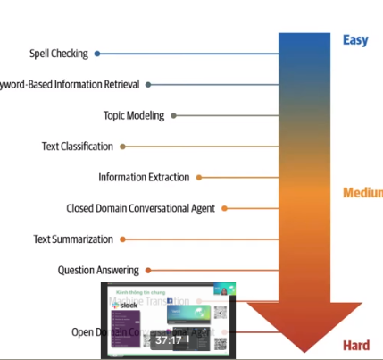

Why is NPL challenging?

Ngôn ngữ con người mang sự mơ hồ, ý nghĩa phụ thuộc nhiều vào ngữ cảnh, thành ngữ, nhiều ngôn ngữ.

#### Approaches to NPL

- Heuristics-Based (rule based)
- Classical Machine Learning (e.g Naive Bayes, SVM, HMM, CRF,... )
- Deep Learning

### Deep learning for NLP

- Recurrent newral networks
- Long short-term memory
- Convolutional neural networks
- Autoencoders: E.g: Từ một câu sinh ra câu mới
- Transformers

#### Why DL Is Not Yet the Silver Bullet for NLP

- Overfitting on small datasets
- Interpertable models
- Cost
- On-device deployment

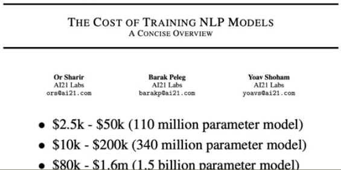

Tốn tiền quá z trời.

GPU Tesla T4 vs GPT-2 1 lúc chỉ dc 4-5 người.

Tối ưu mô hình quá có thể làm giảm nhiều độ chính xác.

### embedding + word2vec

Giúp máy hiểu được ngôn ngữ: 

Giải thiết phân phối: 2 từ cũng ngữ cảnh khả năng cao giống nhau.

Word Smilarity

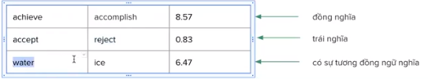

Ý nghĩa của một từ( The meaning of word): xác định một từ dựa vào những từ xung quanh.

Mô hình một từ thành vector

TF IDF, Word2vec

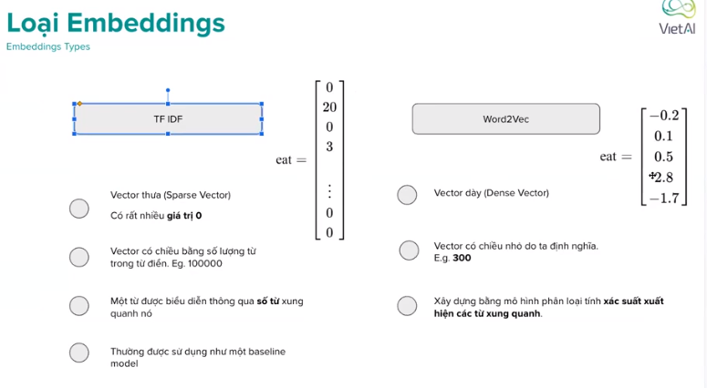

Word-vector: Mô hình hóa từ thành vector dựa trên số lần xuất hiện của từ trong văn bản

Word-word Matrix: 

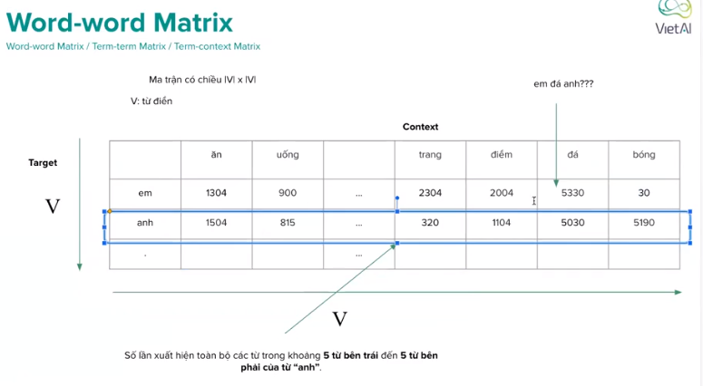

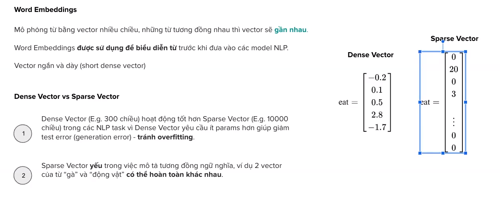

### Word2vec

How to build word2vec

vector one hot

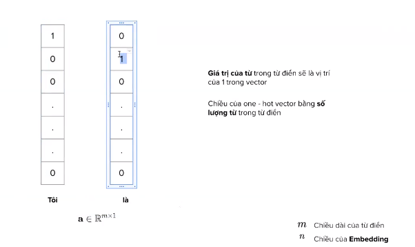

Mô hình CBOW(continuous Bag of words)

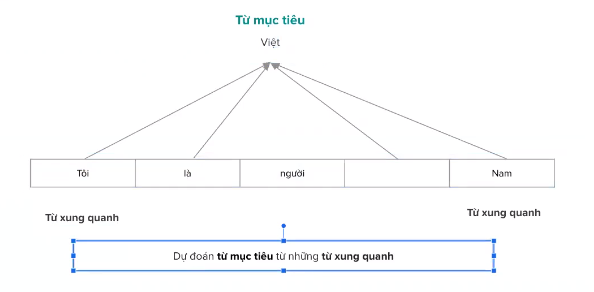

Lấy từ khỏi một câu làm nhãn.

Đầu vào là câu bị khuyết từ. Nhãn là từ bị khuyết.

Mô hình học các điền vào chỗ trống. 

Position của từ sẽ không quan trọng.

Word2vec là static embedding(một từ sẽ là một vector cố định) không giải quyết đc sự mơ hồ của câu. -> sài dynamic contextual embedding. 

**Mô hình CBOW**

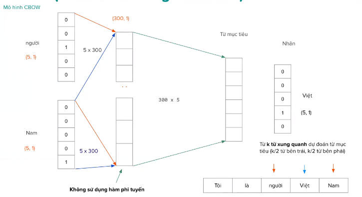

CBOW giống bài toán phân loại. Autoencoders tái tạo lại chính câu,...

P(Y|X)

P(X)

**Skip Gram**

Skip-gram ngược lại với CBOW

Skip Gram : một từ bị thiếu dự đoán những từ xung quanh

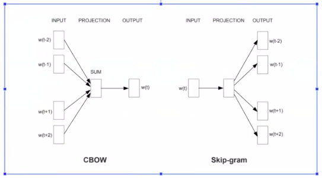

**Word2Vec**

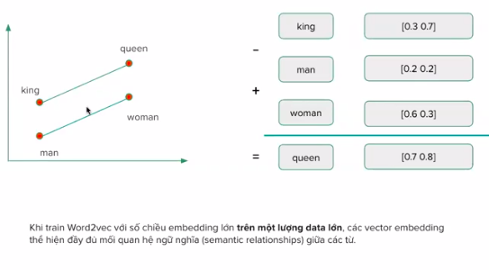

Các vector đã có ngữ nghĩa, quan hệ với nhau. Giúp máy có thể hiểu được sau khi train trên một lượng data đủ lớn.

**Sử dung word2vec**

Lấy vector onehot * W => vector embedding của mỗi từ

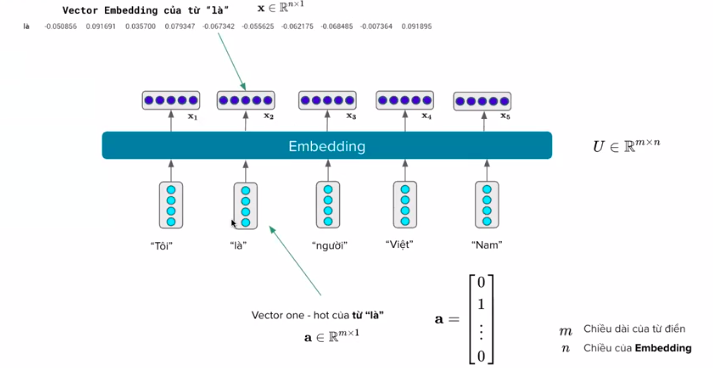

**Biểu diễn sâu( Deep Presentation**

Điểm Yếu: 

- Biểu diễn các từ vẫn còn yếu (shallow representation) (fix embedding)
- Một số model không dùng Embedding chỉ giảm dưới 1% độ chính xác
- THông tin word-level khó xác định phù hợp với bài toán cụ thể nào

Giải quyết: Cần một biểu diễn mạnh/ động hơn ( thậm chí có thể thay đổi theo ngữ cảnh):

- LSTM-based (ULMfit, ELMO)
- Transformer-based (BERT, GPT)

**Language Models**

Được thiết kế với mục tiêu đo lường phân phối xác suất của các đơn vị ngôn ngữ (từ|chữ)

Nhiệm vụ: Tính P(w|h) xác suất của một từ khi cho các từ trước đó (lịch sử)

w: từ, h: lịch sử P("ơi|Việt nam đẹp lắm ta") = ??

language model xuất hiện trong nhiều hệ thống khác nhau: đề xuất từ tiếp theo, máy dịch, sửa lỗi

N-Grams

Unigram, Bigram, Trigram, 4-gram

**Giả thiết Markov:** Xác suất xảy ra một từ khi cho lịch sử sẽ bằng xác suất xảy ra từ đó khi cho n-1 từ trước nó.

P(vui|Thông qua khảo sát của những tổ chức nghiên cứu, học Tiếng Việt rất) = (vui| học Tiếng Việt rất)

Điểm yếu của N-grams language model

**Neural Language Models**

**RNN( Recurrent neural network)**

Ưu điểm của RNN

Nhược điểm của RNN

Mất mát sử dụng Teacher Forcing.

**Perplexity (PP)**

